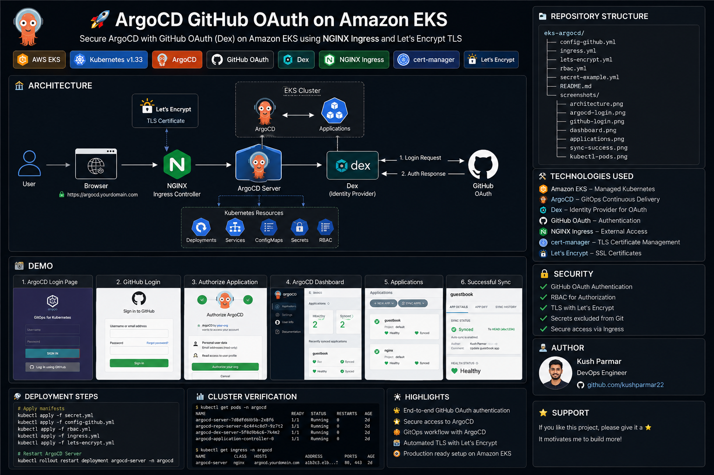
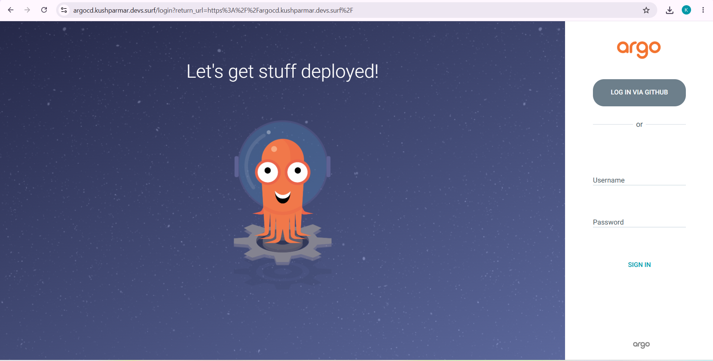
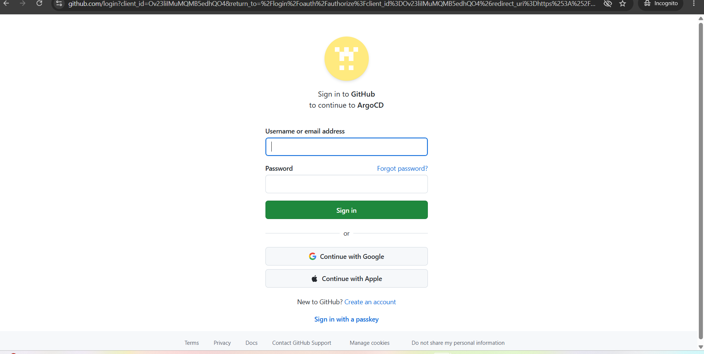
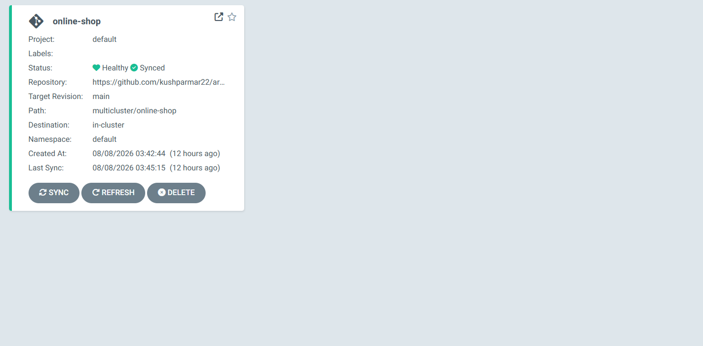
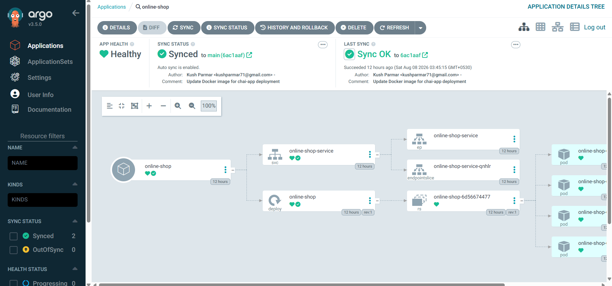

# 🚀 ArgoCD GitHub OAuth on Amazon EKS

Configure **GitHub OAuth authentication** for **ArgoCD** running on **Amazon EKS** using **Dex**, **NGINX Ingress**, and **Let's Encrypt TLS**.

---

# 🏗️ Architecture

---

# 📸 Project Demo

## ArgoCD Login

---

## GitHub OAuth Login

---

## Applications Dashboard

---

## Successful Sync

---

# 📂 Project Files

- config-github.yml
- ingress.yml
- lets-encrypt.yml
- rbac.yml
- secret-example.yml

---

# ⚙️ Technologies

- Amazon EKS
- Kubernetes
- ArgoCD
- GitHub OAuth
- Dex
- NGINX Ingress
- cert-manager
- Let's Encrypt

---

# 🔐 Security

✔ Secrets excluded from Git

✔ OAuth Authentication

✔ TLS Enabled

✔ RBAC Configured

---

# 👨‍💻 Author

**Kush Parmar**

